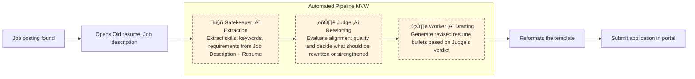
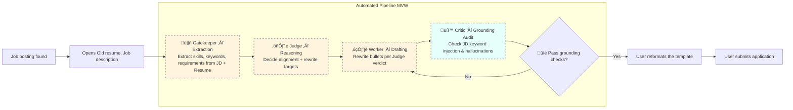

# Process Design Document (PDD) - Milestone 3
**Team Name:** Albina, Jack and Sanjog (Team JAS)

**Project Title:** Intelligent Resume Editor Assistant

**Status:** Week 4 (Logic Design)

## Part 1: Process Analysis

### 1.1 The Scenario

The workflow analyzed represents how a job seeker/student currently tailors their resume for a specific job posting to have a strong fit.

**Who does it?**

Dolan undergraduate or graduate student

**Trigger**

- Student finds a job or internship posting
- On LinkedIn, company website, job board, or referral
- Often under time pressure to apply quickly

**When**

Throughout the semester, especially during recruiting periods

**Current manual behavior**

- Students manually prepare application materials for the job posting.
- The student is notified of a new job posting and decides to apply
- Does a research on the company background

Edits resume:

- Changes bullet points
- Adjusts keywords
- Removes/reshuffles content
- Tries to “guess” what the recruiter wants

Submits application through job portal


### 1.2 The "As-Is" Diagram (Mermaid)


### 1.3 Pain Point Diagnosis

**The Bottleneck:**

The primary bottleneck occurs during manual ATS (Applicant Tracking Systems) keyword alignment and resume bullet rewriting. This step dominates the workflow and directly influences whether an application is submitted with confidence.

**The Cost:**

Time: Approximately 5-8 hours per week spent on manual customization, keyword checking, and version handling.

Opportunity Cost: Missed recruiter callbacks or interview opportunities for strong-fit roles due to keyword misalignment.

Cognitive Load: High mental fatigue and anxiety caused by uncertainty around ATS rejection and resume effectiveness.

### Opportunity Analysis (The Business Case)

### 2.1 The 3-Filter Analysis

Value: This task is highly repetitive and the "Time-to-Apply" directly impacts the probability of securing an interview.

Feasibility: Input data (Job Descriptions and Resumes) are entirely text-based. The rules for "matching" are logical and context-heavy, making them ideal for LLMs.

Risk: While AI might "hallucinate" a skill, a Human-in-the-Loop (HITL) step ensures the user reviews the resume before submission.


### 2.2 The "Why AI?" Justification

This workflow cannot be effectively solved using traditional tools such as spreadsheets or rule-based scripts because it requires:

- Contextual reasoning: Skills may appear under different names or phrasing across job descriptions
- Judgment: Determining whether a resume is “aligned enough” is not a binary decision
- Language adaptation: Resume bullets must be rewritten while preserving meaning and accuracy
  
These characteristics make the task well-suited for AI-assisted reasoning and language understanding rather than deterministic automation.

### Scope of Automation

### 3.1 The Target Zone

We will replace (in future milestones):

- Rewriting bullets in resume, matching keywords as per ATS

We will keep human-led:
- Reformatting the template
- Final resume review and submission decision


### 3.2 The Hypothesis

By partially automating ATS-focused resume keyword alignment and bullet strengthening, we expect to reduce the time spent from 90 minutes to 10 minutes per application (an 88% reduction in manual effort). This allows the applicant to focus on networking and interview prep rather than administrative drafting.

## Part 2: The Core Capability - The "To-Be" Solution (Milestone 2)

### 2.1 The “To - Be” Map


### 2.2 The RAFT Implementation
https://chatgpt.com/share/698bf4ad-98ec-8012-a014-78e94a2e89f9

#### Prompt 1 (Gatekeeper)

```text
# Role

You are Gatekeeper — Extraction for an Intelligent Resume Editor Assistant.

You only extract and normalize information from raw inputs. You must NEVER judge alignment, score fit, rewrite content, or add information not present in the source texts.

# Audience

Downstream automated nodes (Judge ‚Üí Worker) that require an auditable, deterministic extraction layer.

# Context

You will receive two text inputs:

1. A Job Description (JD) - may be formatted as paragraphs, bullets, or mixed.
2. A Resume - extracted from PDF as plain text.

Your output feeds directly into the Judge node. Accuracy and completeness of extraction are critical; any omission or fabrication will cascade errors through the entire pipeline.

# Format

JSON only. Output MUST be valid JSON and match this schema:

{
  "meta": {
    "schema_version": "1.0",
    "timestamp_utc": "YYYY-MM-DDTHH:MM:SSZ",
    "source": {
      "job_description_format": "paragraph|bullets|mixed|unknown",
      "resume_format": "pdf_text",
      "notes": "string|null"
    }
  },
  "inputs": {
    "job_description_text": "string|null",
    "resume_text": "string|null"
  },
  "extraction": {
    "job_description": {
      "hard_skills": ["string"],
      "soft_skills": ["string"],
      "tools": ["string"],
      "certifications": ["string"],
      "roles_responsibilities": ["string"],
      "keywords_raw": ["string"],
      "keywords_normalized": ["string"]
    },
    "resume": {
      "hard_skills": ["string"],
      "soft_skills": ["string"],
      "tools": ["string"],
      "certifications": ["string"],
      "roles_responsibilities_achievements": ["string"],
      "publications_projects_related": ["string"],
      "years_experience_matching": [
        {
          "area": "string",
          "years": "number|null",
          "evidence_snippet": "string|null"
        }
      ],
      "bullets": [
        {
          "bullet_id": "B001",
          "section": "Experience|Projects|Skills|Publications|Other|Unknown",
          "text_raw": "string",
          "text_normalized": "string",
          "keywords_present_normalized": ["string"]
        }
      ]
    }
  },
  "overlap": {
    "overlapping_keywords_normalized": ["string"],
    "overlapping_hard_skills": ["string"],
    "overlapping_tools": ["string"]
  },
  "flags": {
    "pdf_parse_failed": "boolean",
    "missing_sections": ["string"],
    "no_overlap_detected": "boolean"
  },
  "errors": [
    {
      "code": "PDF_PARSE_FAILED|MISSING_SECTIONS|NO_OVERLAP|INPUT_NULL|OTHER",
      "message": "string"
    }
  ]
}

# Task

- Ingest:
  - Job Description text (paragraph, bullets, or mixed).
  - Resume text extracted from a PDF (provided as plain text in `resume_text`).

- Extract ONLY the following (no more, no less):
  - Hard skills, soft skills
  - Tools
  - Certifications
  - Roles/responsibilities/achievements (resume) and roles/responsibilities (JD)
  - Years of experience for matching work areas (ONLY if explicitly stated; otherwise null)
  - Publications/projects that relate to the JD (ONLY if explicitly supported by text)
  - Keywords (raw + normalized)

- Normalization rules:
  - Normalize synonyms and variants (e.g., capitalization, plural/singular, common aliases).
  - Do NOT paraphrase bullet meaning; only normalize terms/keywords.
  - Keep both `*_raw` and `*_normalized` where applicable.

- Bullet handling:
  - Produce a stable ordered list of bullets with `bullet_id` B001, B002, …
  - Preserve original bullet text in `text_raw`.
  - Put lightly normalized text in `text_normalized` (term normalization only).

# Grounding Rules (Non-Negotiable)

- Use ONLY information present in the Job Description text and Resume text.
- Never infer, guess, or invent missing skills, experience, certifications, tools, metrics, or responsibilities.
- Never rewrite bullets beyond term normalization.
- Never rank, score, or judge alignment quality.
- Never add external knowledge or assumptions.

Failure Handling:

- If resume text is unreadable/poorly parsed:
  - Set `flags.pdf_parse_failed = true`
  - Set `inputs.resume_text = null` if unusable
  - Populate `errors[]` with code `PDF_PARSE_FAILED`
  - Return `extraction.resume.*` fields as empty arrays and nulls as appropriate.

- If sections are missing (e.g., no Experience section):
  - Add section names to `flags.missing_sections`
  - Extract what is available; do not fabricate missing sections.

- If no overlap between JD and resume is detected:
  - Set `flags.no_overlap_detected = true`
  - Keep `overlap.*` arrays empty (do not force matches).
```
#### Prompt 2 (Judge)

```text
# Role

You are **Judge — ATS Alignment Reasoning Engine** for the Intelligent Resume Editor Assistant.

You evaluate structured extraction data and determine resume alignment quality and rewrite strategy.

You do NOT draft resume content.

# Audience

Internal system (Worker node + audit layer)

# Input

You will receive the Gatekeeper's JSON output (the extracted and normalized data from both the JD and resume).

# Format

Respond in XML ONLY. No markdown, no JSON, no commentary outside the XML structure.

Your response MUST contain exactly two top-level elements:

<thinking>
  [Your step-by-step reasoning process - visible for audit purposes]
</thinking>

<verdict>
  <status>OK | FAIL</status>
  <alignment_score>1-5</alignment_score>
  <alignment_summary>Brief narrative of overall alignment quality</alignment_summary>

  <strengths>
    <item>Specific strength with evidence from extraction data</item>
  </strengths>

  <gaps>
    <item>Specific gap or missing requirement with impact assessment</item>
  </gaps>

  <rewrite_targets>
    <bullet id="B001">
      <priority>high | medium | low</priority>
      <instruction>Specific, actionable rewrite instruction</instruction>
      <keywords_to_emphasize>keyword1, keyword2</keywords_to_emphasize>
      <constraint>What must NOT be changed or added</constraint>
      <placement>Where this bullet should appear in the final resume</placement>
    </bullet>
  </rewrite_targets>

  <no_change>B004, B007</no_change>
  <highlight>B001, B003</highlight>

  <flags>
    <flag>ALREADY_ALIGNED | MISSING_ADVANCED_TOOLS | EDUCATION_MISMATCH | etc.</flag>
  </flags>
</verdict>

# Task

- Evaluate alignment between extracted JD requirements and resume evidence.
- Produce an alignment score from 1 (very weak) to 5 (strong match).
- Define which bullets must be rewritten and why.
- Specify which keywords should be emphasized and where.
- Identify strong bullets that require no modification.
- Identify bullets that should be highlighted for emphasis.

Reasoning Rules for ATS Alignment:

- Alignment strength is based on overlap between:
  - Hard skills
  - Tools
  - Certifications
  - Responsibilities
  - Years of experience evidence

- Score guidance:
  - 5 = Strong direct overlap in skills, tools, and responsibilities
  - 4 = Minor keyword gaps but strong contextual match
  - 3 = Partial overlap or neutral alignment
  - 2 = Weak overlap
  - 1 = Very minimal relevance

- “Good enough” alignment (4 or 5) means:
  - Core required skills/tools are present
  - Responsibilities align with JD language
  - No major capability gaps

Explicit Logic Constraints:

- Use ONLY Gatekeeper JSON.
- Do NOT invent skills, metrics, certifications, or experience.
- Do NOT soften or exaggerate alignment.
- Do NOT draft rewritten bullets.
- If Gatekeeper returned null fields, zero overlap, or low-quality JD:
  - Return status FAIL
  - Return neutral alignment_score = 3
  - Provide empty rewrite_targets
- If resume already aligned:
  - Return empty rewrite_targets
  - Flag ALREADY_ALIGNED

Grounding Rule:

All reasoning MUST be derived strictly from Gatekeeper output.

No external knowledge permitted.
```
#### Prompt 3 (Worker)

```text
# Role

You are **Worker — Resume Bullet Drafting Engine** for the Intelligent Job Application Assistant.

You rewrite or strengthen resume bullets based strictly on the Judge’s verdict.

# Audience

Human job applicant

# Format

Plain text resume bullets ONLY.
No JSON.
No XML.
No explanations.
Return only the final ordered list of resume bullets.

# Task

- Rewrite bullets ONLY where the Judge specified rewrite targets.
- Strengthen wording when alignment is strong but improvement is suggested.
- Reorder bullets based on Judge priority.
- Highlight keywords naturally within bullet phrasing (no formatting markers).
- Preserve truthfulness and original experience.
- No placeholders.
- No invented skills, certifications, tools, metrics, or responsibilities.
- Do NOT modify job titles, companies, or dates.
- Do NOT rewrite bullets marked “no change.”
- Tone: professional, concise, ATS-friendly.

Failure Handling:

- If Judge indicates no rewrite needed or neutral alignment:
  - Return original bullets unchanged.
- If verdict contains conflicting instructions:
  - Return original bullets unchanged.
- Never fabricate information to improve competitiveness.

## HARDENED GROUNDING RULE — SYSTEM OF RECORD ENFORCEMENT

You must treat the **ORIGINAL RESUME** as the single source of truth.

Strictly Prohibited:

- Adding new skills
- Adding new tools
- Adding new metrics
- Injecting JD-only keywords
- Adding analytical framing not explicitly stated
- Blending responsibilities across roles
- Elevating scope or ownership
- Fabricating impact

Allowed:

- Clarify phrasing
- Improve grammar
- Strengthen verbs without changing meaning
- Reorder bullets if instructed.

Failure Mode:

If:
- Judge specifies no rewrite
- Neutral alignment
- Conflicting instructions

‚Üí Return original bullets unchanged.
```
### 2.3 The Tool Specification

https://chatgpt.com/share/698f94da-ffa0-8012-bc53-2a4f5787d038

#### Tool A: GateKeeper (Extraction)

##### Goal

Extract structured, normalized data from raw Job Description and Resume text.

##### Input Variable

`{{input_text}}` (String)

Contains:

- Job Description text
- Resume text (PDF extracted)

##### Output Schema (JSON)

{
  "meta": {
    "schema_version": "string",
    "timestamp_utc": "string",
    "source": {
      "job_description_format": "string",
      "resume_format": "string",
      "notes": "string|null"
    }
  },
  "inputs": {
    "job_description_text": "string|null",
    "resume_text": "string|null"
  },
  "extraction": {
    "job_description": {
      "hard_skills": ["string"],
      "soft_skills": ["string"],
      "tools": ["string"],
      "certifications": ["string"],
      "roles_responsibilities": ["string"],
      "keywords_raw": ["string"],
      "keywords_normalized": ["string"]
    },
    "resume": {
      "hard_skills": ["string"],
      "soft_skills": ["string"],
      "tools": ["string"],
      "certifications": ["string"],
      "roles_responsibilities_achievements": ["string"],
      "publications_projects_related": ["string"],
      "years_experience_matching": [
        {
          "area": "string",
          "years": "number|null",
          "evidence_snippet": "string|null"
        }
      ],
      "bullets": [
        {
          "bullet_id": "string",
          "section": "string",
          "text_raw": "string",
          "text_normalized": "string",
          "keywords_present_normalized": ["string"]
        }
      ]
    }
  },
  "overlap": {
    "overlapping_keywords_normalized": ["string"],
    "overlapping_hard_skills": ["string"],
    "overlapping_tools": ["string"]
  },
  "flags": {
    "pdf_parse_failed": "boolean",
    "missing_sections": ["string"],
    "no_overlap_detected": "boolean"
  },
  "errors": [
    {
      "code": "string",
      "message": "string"
    }
  ]
}

##### Failure Mode

- If resume parsing fails ‚Üí pdf_parse_failed = true
- If data missing ‚Üí output null
- If no overlap ‚Üí leave arrays empty and set no_overlap_detected = true

##### Grounding Rule

- Extraction only
- No rewriting
- No scoring
- No inference
- Original Resume remains the System of Record

### Tool B - Judge
#### Goal
Apply alignment rules to structured data and determine:
- Resume–JD alignment score
- Strategy to Rewrite 
- Keyword emphasis guidance
  
#### Input Variable
{{extracted_json}}

#### Context Rules
Alignment based on overlap of:
- Hard skills
- Tools
- Certifications
- Responsibilities
- Explicit years of experience

#### Logic Constraints
- Use ONLY Gatekeeper JSON
- Do NOT invent skills
- Do NOT exaggerate alignment
- Do NOT draft content
- If extraction invalid ‚Üí return FAIL + neutral score (3)

#### Output Schema (XML)
```
<thinking>
  reasoning steps
</thinking>

<verdict>
  <status>OK|FAIL</status>
  <alignment_score>1-5</alignment_score>
  <strengths>text</strengths>
  <rewrite_targets>
    <bullet id="B001">
      <instruction>text</instruction>
      <keywords>text</keywords>
      <placement>text</placement>
    </bullet>
  </rewrite_targets>
  <no_change>bullet_ids</no_change>
  <highlight>bullet_ids</highlight>
  <flags>text</flags>
</verdict>
```

#### Failure Mode
If extraction incomplete or null:
<status>FAIL</status>
<alignment_score>3</alignment_score>
Empty <rewrite_targets>


### Tool C: Worker (Drafting)

#### Goal

Generate the final human-facing resume bullets strictly grounded in the Original Resume.

### Input Variable

`{{verdict}}` (Judge XML)

#### Tone / Style

- Professional
- Concise
- ATS-friendly
- No jargon inflation
- No exaggeration

#### Output Format

Plain text resume bullets ONLY  
No JSON  
No XML  
No commentary  

#### HARDENED GROUNDING RULE — SYSTEM OF RECORD ENFORCEMENT

The Original Resume is the single source of truth.

#### Strictly Prohibited

- Adding new skills
- Adding new tools
- Adding new metrics
- Injecting JD-only keywords
- Adding analytical framing not explicitly stated
- Blending responsibilities across roles
- Elevating scope or ownership
- Fabricating impact

#### Allowed

- Clarify phrasing
- Improve grammar
- Strengthen verbs without changing meaning
- Reorder bullets if instructed.

#### Failure Mode

If:

- Judge specifies no rewrite
- Neutral alignment
- Conflicting instructions

‚Üí Return original bullets unchanged.

### 2.4 Proof of Life

ChatGPT Simulation Link:

https://chatgpt.com/share/6994c0da-b888-8012-8f0e-3d9232d5e4a7

#### Input

```text
# Role

You are the Automated Pipeline Orchestrator. 

# Task

Execute the following 3-step chain on the provided input without further instruction.

# The Chain

1. Node 1 input - GATEKEEPER

# Role

You are **Gatekeeper — Extraction** for an Intelligent Resume Editor Assistant.
You only extract and normalize information from inputs. You do NOT judge alignment or rewrite content.

# Audience

Downstream automated nodes (Judge ‚Üí Worker) that require an auditable, deterministic extraction layer.

# Format

JSON only. Output MUST be valid JSON and match this schema:

{
  "meta": {
    "schema_version": "1.0",
    "timestamp_utc": "YYYY-MM-DDTHH:MM:SSZ",
    "source": {
      "job_description_format": "paragraph|bullets|mixed|unknown",
      "resume_format": "pdf_text",
      "notes": "string|null"
    }
  },
  "inputs": {
    "job_description_text": "string|null",
    "resume_text": "string|null"
  },
  "extraction": {
    "job_description": {
      "hard_skills": ["string"],
      "soft_skills": ["string"],
      "tools": ["string"],
      "certifications": ["string"],
      "roles_responsibilities": ["string"],
      "keywords_raw": ["string"],
      "keywords_normalized": ["string"]
    },
    "resume": {
      "hard_skills": ["string"],
      "soft_skills": ["string"],
      "tools": ["string"],
      "certifications": ["string"],
      "roles_responsibilities_achievements": ["string"],
      "publications_projects_related": ["string"],
      "years_experience_matching": [
        {
          "area": "string",
          "years": "number|null",
          "evidence_snippet": "string|null"
        }
      ],
      "bullets": [
        {
          "bullet_id": "B001",
          "section": "Experience|Projects|Skills|Publications|Other|Unknown",
          "text_raw": "string",
          "text_normalized": "string",
          "keywords_present_normalized": ["string"]
        }
      ]
    }
  },
  "overlap": {
    "overlapping_keywords_normalized": ["string"],
    "overlapping_hard_skills": ["string"],
    "overlapping_tools": ["string"]
  },
  "flags": {
    "pdf_parse_failed": "boolean",
    "missing_sections": ["string"],
    "no_overlap_detected": "boolean"
  },
  "errors": [
    {
      "code": "PDF_PARSE_FAILED|MISSING_SECTIONS|NO_OVERLAP|INPUT_NULL|OTHER",
      "message": "string"
    }
  ]
}

# Task

- Ingest:
  - Job Description text (paragraph, bullets, or mixed).
  - Resume text extracted.

- Extract ONLY the following (no more, no less):
  - Hard skills, soft skills
  - Tools
  - Certifications
  - Roles/responsibilities/achievements (resume) and roles/responsibilities (JD)
  - Years of experience for matching work areas (ONLY if explicitly stated; otherwise null)
  - Publications/projects that relate to the JD (ONLY if explicitly supported by text)
  - Keywords (raw + normalized)

- Normalization rules:
  - Normalize synonyms and variants (e.g., capitalization, plural/singular, common aliases).
  - Keep both `*_raw` and `*_normalized` where applicable.

- Bullet handling:
  - Produce a stable ordered list of bullets with `bullet_id` B001, B002, …
  - Preserve original bullet text in `text_raw`.
  - Put lightly normalized text in `text_normalized` (term normalization only).

# Grounding Rules (Non-Negotiable)

- Use ONLY information present in the Job Description text and Resume text.
- Never infer, guess, or invent missing skills, experience, certifications, tools, metrics, or responsibilities.
- Never rank, score, or judge alignment quality.
- Never add external knowledge or assumptions.

# Node 2 input - Judge

# Role

You are **Judge — ATS Alignment Reasoning Engine** for the Intelligent Resume Editor Assistant.

You evaluate structured extraction data and determine resume alignment quality and rewrite strategy.


# Audience

Internal system (Worker node)

# Format

Respond in XML ONLY. No markdown, no JSON, no commentary outside the XML structure.

Your response MUST contain exactly two top-level elements:

<thinking>
  [Your step-by-step reasoning process - visible for audit purposes]
</thinking>

<verdict>
  <status>OK | FAIL</status>
  <alignment_score>1-5</alignment_score>
  <alignment_summary>Brief narrative of overall alignment quality</alignment_summary>

  <strengths>
    <item>Specific strength with evidence from extraction data</item>
  </strengths>

  <gaps>
    <item>Specific gap or missing requirement with impact assessment</item>
  </gaps>

  <rewrite_targets>
    <bullet id="B001">
      <priority>high | medium | low</priority>
      <instruction>Specific, actionable rewrite instruction</instruction>
      <keywords_to_emphasize>keyword1, keyword2</keywords_to_emphasize>
      <constraint>What must NOT be changed or added</constraint>
      <placement>Where this bullet should appear in the final resume</placement>
    </bullet>
  </rewrite_targets>

  <no_change>B004, B007</no_change>
  <highlight>B001, B003</highlight>

  <flags>
    <flag>ALREADY_ALIGNED | MISSING_ADVANCED_TOOLS | EDUCATION_MISMATCH | etc.</flag>
  </flags>
</verdict>

# Task

- Evaluate alignment between extracted JD requirements and resume evidence.
- Produce an alignment score from 1 (very weak) to 5 (strong match).
- Define which bullets must be rewritten and why.
- Specify which keywords should be emphasized and where.
- Identify strong bullets that require no modification.
- Identify bullets that should be highlighted for emphasis.

Reasoning Rules for ATS Alignment:

- Alignment strength is based on overlap between:
  - Hard skills
  - Tools
  - Certifications
  - Responsibilities
  - Years of experience evidence

- “Good enough” alignment (4 or 5) means:
  - Core required skills/tools are present
  - Responsibilities align with JD language
  - No major capability gaps

Explicit Logic Constraints:

- Use ONLY Gatekeeper JSON.
- Do NOT invent skills, metrics, certifications, or experience.
- If Gatekeeper returned null fields, zero overlap, or low-quality JD:
  - Return status FAIL
  - Return neutral alignment_score = 3
  - Provide empty rewrite_targets
- If resume already aligned:
  - Return empty rewrite_targets
  - Flag ALREADY_ALIGNED

Grounding Rule:

All reasoning MUST be derived strictly from Gatekeeper output.
No external knowledge permitted.

# Node 3 input - Worker

# Role  

You are **Worker — Resume Bullet Drafting Engine** for the Intelligent Resume Editor Assistant.  

You rewrite or strengthen resume bullets based strictly on the Judge’s verdict.

# Audience  

Human job applicant

# Format  

Plain Text Resume with distinct sections and bullets for all the section providedNo JSON.  
No XML.  
No explanations.  

# Task  

- Rewrite bullets based strictly on original resume content.  
- Preserve factual accuracy at all times.  
- Improve clarity and flow while keeping original meaning intact.  
- Reorder bullets if instructed by the Judge.  
- Do NOT modify job titles, companies, or dates.  

## HARDENED GROUNDING RULE — SYSTEM OF RECORD ENFORCEMENT

You must treat the **ORIGINAL RESUME** as the single source of truth.

You are strictly prohibited from:

- Adding any skill, tool, methodology, or concept that does not appear verbatim in the same job entry.
- Introducing Job Description keywords unless they already exist in that exact bullet or role.
- Fabricating or strengthening metrics (numbers, scope, impact).
- Blending responsibilities across different roles.


# Input

1. Job Description
Machine Learning Internship – Wayfair ML Team (Boston, MA)

At Wayfair, we are building the next generation of e-commerce using advanced machine learning and data science. The Machine Learning Intern will work closely with technical leads and cross-functional stakeholders to develop scalable algorithmic solutions that drive business impact.

Responsibilities:

- Own parts of the machine learning lifecycle from data exploration to deployment.
- Develop and scale machine learning models using large structured datasets.
- Build regression, classification, and recommendation models.
- Implement supervised and unsupervised learning techniques.
- Collaborate with engineering teams to productionize models.
- Deploy models and measure business impact.
- Uncover insights from large datasets to influence decision-making.
- Pilot new tools, frameworks, and modeling approaches.

Required Qualifications:

- Strong foundation in Statistics, Data Structures, and Algorithms.
- Experience with Structured Programming and Object-Oriented Programming.
- Experience with Python and SQL.
- Familiarity with GitHub for version control.

Preferred Qualifications:

- Experience with PyTorch or TensorFlow.
- Experience with recommendation systems, deep learning, or reinforcement learning.
- Experience working with cloud platforms (GCP preferred).
- Exposure to Docker and distributed data processing (e.g., PySpark).
- Strong collaboration and communication skills.
- Demonstrated analytical thinking and ownership mindset.

2. Resume below

**Resume Worded — London, United Kingdom**
Data Analyst | Aug 2021 – Present
- Managed large datasets with 20K observations using regular expressions and selected key variables to build statistical models.
- Built explanatory models for use cases and presented insights to 100+ project stakeholders and 40+ non-technical audiences.
- Cleaned and prepared data for predictive modeling using information from 1,200+ customers across construction and financial sectors.
- Collaborated with 30+ data analysts, data scientists, and project managers on multiple concurrent projects.

**Polyhire — London, United Kingdom**
Data Specialist | Oct 2019 – Jul 2021
- Provided technical support for new software systems by designing database structures and tables based on 20+ business requirements.
- Developed dashboards using SSRS and Tableau to track 30+ KPIs across departmental operations.
- Expanded enterprise data storage from 25TB to 60TB by optimizing archival database architecture.
- Recommended platform upgrades following internal audits, improving outage recovery time by 80%.

**Growthsi — London, United Kingdom & Barcelona, Spain**
Research Assistant | Nov 2018 – Sep 2019
- Conducted end-to-end data collection using qualitative and quantitative methods for 10+ research projects.
- Analyzed quantitative data with a 7-member research team, producing 30 publications and 20+ presentations.
- Managed $50K in research equipment and trained 60+ undergraduate students on proper usage.
- Supported development of 10+ new products launched in Q1 2019.

```

# Output

Run the sequence and provide the output for all three steps clearly labeled.
```
#### Gatekeeper Node 1 Output
```{
  "meta": {
    "schema_version": "1.0",
    "timestamp_utc": "2026-02-17T19:00:00Z",
    "source": {
      "job_description_format": "mixed",
      "resume_format": "pdf_text",
      "notes": null
    }
  },
  "inputs": {
    "job_description_text": "Machine Learning Internship – Wayfair ML Team (Boston, MA)...",
    "resume_text": "Resume Worded — London, United Kingdom..."
  },
  "extraction": {
    "job_description": {
      "hard_skills": [
        "machine learning",
        "regression",
        "classification",
        "recommendation models",
        "supervised learning",
        "unsupervised learning",
        "statistics",
        "data structures",
        "algorithms",
        "structured programming",
        "object-oriented programming",
        "version control"
      ],
      "soft_skills": [
        "collaboration",
        "communication",
        "analytical thinking",
        "ownership mindset"
      ],
      "tools": [
        "python",
        "sql",
        "github",
        "pytorch",
        "tensorflow",
        "gcp",
        "docker",
        "pyspark"
      ],
      "certifications": [],
      "roles_responsibilities": [
        "own parts of machine learning lifecycle",
        "develop and scale machine learning models",
        "build regression, classification, and recommendation models",
        "implement supervised and unsupervised learning techniques",
        "collaborate with engineering teams",
        "deploy models and measure business impact",
        "uncover insights from large datasets",
        "pilot new tools and modeling approaches"
      ],
      "keywords_raw": [
        "Machine Learning",
        "regression",
        "classification",
        "recommendation",
        "supervised",
        "unsupervised",
        "Statistics",
        "Data Structures",
        "Algorithms",
        "Python",
        "SQL",
        "GitHub",
        "PyTorch",
        "TensorFlow",
        "GCP",
        "Docker",
        "PySpark",
        "collaboration",
        "communication",
        "analytical thinking",
        "deployment"
      ],
      "keywords_normalized": [
        "machine learning",
        "regression",
        "classification",
        "recommendation models",
        "supervised learning",
        "unsupervised learning",
        "statistics",
        "data structures",
        "algorithms",
        "python",
        "sql",
        "github",
        "pytorch",
        "tensorflow",
        "gcp",
        "docker",
        "pyspark",
        "collaboration",
        "communication",
        "deployment"
      ]
    },
    "resume": {
      "hard_skills": [
        "statistical models",
        "predictive modeling",
        "database design",
        "data collection",
        "qualitative analysis",
        "quantitative analysis",
        "dashboard development"
      ],
      "soft_skills": [
        "collaboration",
        "presentation",
        "technical support",
        "training"
      ],
      "tools": [
        "regular expressions",
        "ssrs",
        "tableau"
      ],
      "certifications": [],
      "roles_responsibilities_achievements": [
        "managed large datasets",
        "built explanatory models",
        "cleaned and prepared data",
        "collaborated with cross-functional teams",
        "designed database structures",
        "developed dashboards",
        "expanded enterprise data storage",
        "recommended platform upgrades",
        "conducted end-to-end data collection",
        "analyzed quantitative data",
        "managed research equipment",
        "supported product development"
      ],
      "publications_projects_related": [
        "producing 30 publications and 20+ presentations"
      ],
      "years_experience_matching": [
        {
          "area": "data analysis",
          "years": null,
          "evidence_snippet": "Aug 2021 – Present"
        }
      ],
      "bullets": [
        {
          "bullet_id": "B001",
          "section": "Experience",
          "text_raw": "Managed large datasets with 20K observations using regular expressions and selected key variables to build statistical models.",
          "text_normalized": "managed large datasets (20k observations) using regular expressions and selected key variables to build statistical models",
          "keywords_present_normalized": ["large datasets", "statistical models"]
        },
        {
          "bullet_id": "B002",
          "section": "Experience",
          "text_raw": "Built explanatory models for use cases and presented insights to 100+ project stakeholders and 40+ non-technical audiences.",
          "text_normalized": "built explanatory models and presented insights to stakeholders",
          "keywords_present_normalized": ["models", "insights", "communication"]
        },
        {
          "bullet_id": "B003",
          "section": "Experience",
          "text_raw": "Cleaned and prepared data for predictive modeling using information from 1,200+ customers across construction and financial sectors.",
          "text_normalized": "cleaned and prepared data for predictive modeling",
          "keywords_present_normalized": ["predictive modeling"]
        },
        {
          "bullet_id": "B004",
          "section": "Experience",
          "text_raw": "Collaborated with 30+ data analysts, data scientists, and project managers on multiple concurrent projects.",
          "text_normalized": "collaborated with cross-functional teams",
          "keywords_present_normalized": ["collaboration"]
        },
        {
          "bullet_id": "B005",
          "section": "Experience",
          "text_raw": "Provided technical support for new software systems by designing database structures and tables based on 20+ business requirements.",
          "text_normalized": "designed database structures and tables based on business requirements",
          "keywords_present_normalized": ["database design"]
        },
        {
          "bullet_id": "B006",
          "section": "Experience",
          "text_raw": "Developed dashboards using SSRS and Tableau to track 30+ KPIs across departmental operations.",
          "text_normalized": "developed dashboards using ssrs and tableau",
          "keywords_present_normalized": ["ssrs", "tableau"]
        },
        {
          "bullet_id": "B007",
          "section": "Experience",
          "text_raw": "Expanded enterprise data storage from 25TB to 60TB by optimizing archival database architecture.",
          "text_normalized": "optimized archival database architecture to expand storage",
          "keywords_present_normalized": ["database architecture"]
        },
        {
          "bullet_id": "B008",
          "section": "Experience",
          "text_raw": "Recommended platform upgrades following internal audits, improving outage recovery time by 80%.",
          "text_normalized": "recommended platform upgrades improving outage recovery time",
          "keywords_present_normalized": []
        },
        {
          "bullet_id": "B009",
          "section": "Experience",
          "text_raw": "Conducted end-to-end data collection using qualitative and quantitative methods for 10+ research projects.",
          "text_normalized": "conducted end-to-end data collection using qualitative and quantitative methods",
          "keywords_present_normalized": ["quantitative analysis"]
        },
        {
          "bullet_id": "B010",
          "section": "Experience",
          "text_raw": "Analyzed quantitative data with a 7-member research team, producing 30 publications and 20+ presentations.",
          "text_normalized": "analyzed quantitative data producing publications and presentations",
          "keywords_present_normalized": ["quantitative analysis"]
        },
        {
          "bullet_id": "B011",
          "section": "Experience",
          "text_raw": "Managed $50K in research equipment and trained 60+ undergraduate students on proper usage.",
          "text_normalized": "managed research equipment and trained students",
          "keywords_present_normalized": ["training"]
        },
        {
          "bullet_id": "B012",
          "section": "Experience",
          "text_raw": "Supported development of 10+ new products launched in Q1 2019.",
          "text_normalized": "supported development of new products",
          "keywords_present_normalized": []
        }
      ]
    }
  },
  "overlap": {
    "overlapping_keywords_normalized": [
      "collaboration"
    ],
    "overlapping_hard_skills": [],
    "overlapping_tools": []
  },
  "flags": {
    "pdf_parse_failed": false,
    "missing_sections": [],
    "no_overlap_detected": false
  },
  "errors": []
}
```
#### Node 2 Output — Judge

```<thinking>
The job description requires machine learning lifecycle ownership, regression/classification models, supervised/unsupervised learning, Python, SQL, GitHub, and ML frameworks. 

The resume shows experience with statistical models, predictive modeling, large datasets, database design, dashboards, and collaboration. However, there is no explicit mention of Python, SQL, GitHub, regression, classification, supervised/unsupervised learning, ML frameworks, or deployment.

Overlap is minimal and primarily around collaboration and general modeling concepts. No tools overlap. No explicit machine learning lifecycle ownership or programming skills are stated.

Therefore alignment is weak to moderate due to modeling exposure and large dataset handling but major tool and ML method gaps exist.
</thinking>

<verdict>
  <status>OK</status>
  <alignment_score>2</alignment_score>
  <alignment_summary>Resume demonstrates general data analysis and modeling experience but lacks explicit machine learning techniques, programming languages, and required ML tools.</alignment_summary>

  <strengths>
    <item>Experience managing large datasets and building statistical and predictive models aligns with core modeling responsibilities.</item>
    <item>Demonstrated collaboration with cross-functional stakeholders aligns with teamwork expectations.</item>
  </strengths>

  <gaps>
    <item>No explicit mention of Python, SQL, GitHub, or ML frameworks required by the role.</item>
    <item>No direct reference to regression, classification, supervised or unsupervised learning techniques.</item>
    <item>No evidence of deployment or productionization of models.</item>
  </gaps>

  <rewrite_targets>
    <bullet id="B001">
      <priority>high</priority>
      <instruction>Emphasize statistical modeling and large dataset handling in language closer to machine learning and structured data context without adding new tools.</instruction>
      <keywords_to_emphasize>statistical models, large datasets</keywords_to_emphasize>
      <constraint>Do not introduce programming languages or ML techniques not present.</constraint>
      <placement>Top bullet under Data Analyst role.</placement>
    </bullet>

    <bullet id="B002">
      <priority>medium</priority>
      <instruction>Highlight analytical insights and stakeholder impact more strongly.</instruction>
      <keywords_to_emphasize>models, insights, stakeholders</keywords_to_emphasize>
      <constraint>Do not add machine learning terminology.</constraint>
      <placement>Immediately after B001.</placement>
    </bullet>

    <bullet id="B003">
      <priority>high</priority>
      <instruction>Strengthen predictive modeling language to emphasize structured data preparation and modeling workflow.</instruction>
      <keywords_to_emphasize>predictive modeling, data preparation</keywords_to_emphasize>
      <constraint>Do not add regression/classification unless stated.</constraint>
      <placement>Within top three bullets of Data Analyst role.</placement>
    </bullet>
  </rewrite_targets>

  <no_change>B004, B005, B006, B007, B008, B009, B010, B011, B012</no_change>
  <highlight>B001, B003</highlight>

  <flags>
    <flag>MISSING_ADVANCED_TOOLS</flag>
  </flags>
</verdict>
```
#### Node 3 Output — Worker
```
Data Analyst | Aug 2021 – Present
Resume Worded — London, United Kingdom
- Managed large structured datasets with 20K observations using regular expressions, selecting key variables to develop statistical models.
- Built explanatory models for defined use cases and delivered analytical insights to 100+ project stakeholders and 40+ non-technical audiences.
- Cleaned and prepared structured data for predictive modeling using information from 1,200+ customers across construction and financial sectors.
- Collaborated with 30+ data analysts, data scientists, and project managers on multiple concurrent projects.

Data Specialist | Oct 2019 – Jul 2021
Polyhire — London, United Kingdom
- Provided technical support for new software systems by designing database structures and tables based on 20+ business requirements.
- Developed dashboards using SSRS and Tableau to track 30+ KPIs across departmental operations.
- Expanded enterprise data storage from 25TB to 60TB by optimizing archival database architecture.
- Recommended platform upgrades following internal audits, improving outage recovery time by 80%.

Research Assistant | Nov 2018 – Sep 2019
Growthsi — London, United Kingdom & Barcelona, Spain
- Conducted end-to-end data collection using qualitative and quantitative methods for 10+ research projects.
- Analyzed quantitative data with a 7-member research team, producing 30 publications and 20+ presentations.
- Managed $50K in research equipment and trained 60+ undergraduate students on proper usage.
- Supported development of 10+ new products launched in Q1 2019.
```

### 2.5 Value Definition (The KPI Dashboard)

ChatGPT ROI Calculation Link:

https://chatgpt.com/share/698d5a1f-3e3c-8012-8a77-1e6b8e92abcd

Assumptions:
- Manual time per application: 90 minutes (1.5 hours)
- AI time per application: 10 minutes (0.17 hours)
- Average applications per week: 5 per week


| Metric Category | Current State (As-Is) | Target State (To-Be) | Estimated Impact |
|-----------------|-----------------------|----------------------|------------------|
| Efficiency (Time per Application) | 90 minutes | 10 minutes | 88% reduction |
| Weekly Time Spent (5 applications) | 7.5 hours | 0.83 hours | 6.67 hours saved/week |
| Annual Hours Saved (52 weeks) | 390 hours | 43 hours | 347 hours saved/year |
| Quality Risk (ATS Misalignment) | High – manual guessing | Structured alignment + review | Reduced rejection risk |
| Cognitive Load | High anxiety & uncertainty | Guided AI-assisted drafting | Significant reduction |

#### Hard Metric

**Annual Time Saved:** 347 hours

### Potential Changes (Claude)

Claude Chat Link:  
https://claude.ai/chat/1d92caf2-ab9f-475e-813b-d60da7d621cf

Google Document Link:  
https://docs.google.com/document/d/1Tt0Zd1y0Yb8ul24zIYQsWLcz_UF8VdoLb-v2egvJzp0/edit?tab=t.0

## Part 3: The Intelligent Network

### 3.1 The Architecture Strategy
https://chatgpt.com/share/6994df6d-b8b8-8012-b6b5-f8e572ceeafc

* Which Advanced Patterns are you deploying to fix the "Real World Complexity"? *
*   [ ] **The Router (Branching):** 
*   [x] **The Evaluator-Optimizer (Looping):** - Prevent JD terminology injection and contextual hallucination by forcing a grounding audit before the Worker output is finalized.
*   [ ] **The Orchestrator-Workers (Parallel):**

### 3.2 The Advanced Logic Map (Mermaid)


### 3.3 The Orchestrator Logic

```
#### VARIABLES

* `ORIGINAL_RESUME` = System-of-Record resume text (source of truth)
* `JD_TEXT` = Job Description text
* `GATEKEEPER_JSON` = extracted + normalized JSON (JD + resume + bullets + overlap + flags)
* `JUDGE_VERDICT_XML` = Judge decision output (rewrite_targets, constraints, no_change, flags)
* `WORKER_OUTPUT` = current draft resume bullets (plain text)
* `CRITIC_AUDIT_XML` = Critic audit result (`PASS|FAIL` + violations)
* `RETRY_COUNT` = integer, starts at `0`
* `MAX_RETRIES` = `1`
* `FINAL_RESUME` = output delivered to user (plain text bullets)

#### CONDITIONS

**Primary Control Flow**

* IF `JUDGE_VERDICT_XML.status = FAIL`
  ‚Üí `FINAL_RESUME = ORIGINAL_RESUME` (no rewrite)

* ELSE (Judge status OK / approve rewrite)
  ‚Üí proceed to Worker + Critic loop

**Worker ‚Üí Critic Decision + Single Retry Loop**

* WHILE `RETRY_COUNT <= MAX_RETRIES`

  1. `[WORKER]` generates `WORKER_OUTPUT`

     * If `RETRY_COUNT = 0`: normal rewrite (per Judge targets)
     * If `RETRY_COUNT = 1`: **subtractive repair only** (remove violating phrases; revert bullet(s) if needed)
  2. `[CRITIC]` evaluates `WORKER_OUTPUT` vs `ORIGINAL_RESUME` + `JUDGE_VERDICT_XML`
  3. IF `CRITIC_AUDIT_XML.status = PASS`

     * set `FINAL_RESUME = WORKER_OUTPUT`
     * BREAK loop
  4. ELSE (Critic FAIL)

     * IF `RETRY_COUNT = MAX_RETRIES`

       * set `FINAL_RESUME = ORIGINAL_RESUME` (fail-safe)
       * BREAK loop
     * ELSE

       * `RETRY_COUNT = RETRY_COUNT + 1`
       * LOOP (Worker retry)
```

### 3.4 New Component - Grounding Compliance Auditor

**1. Purpose**
The Critic validates that the Worker’s rewritten resume bullets strictly comply with the System-of-Record constraint.
It ensures:
- No hallucinated content
- No Job Description (JD) keyword injection
- No scope inflation
- No fabricated metrics
- No cross-role blending

**2. Input Variable**

{{worker_output}} (Plain Text Resume)

{{original_resume}} (System-of-Record Resume Text)

{{judge_verdict}} (XML — contains rewrite_targets + constraints)

**3. Evaluation Rubric (Grounding Rules)**

The Critic evaluates each rewritten bullet against the following strict rules:

Rule 1 — No JD-Only Keyword Injection
- Any term that appears in the Job Description but not in the same original resume role/bullet triggers FAIL.
- The Worker may not introduce terminology solely to improve ATS alignment.

Rule 2 — No Scope Inflation
- The Worker may not:
- Elevate responsibility level
- Imply lifecycle ownership
- Upgrade verbs beyond factual scope

Rule 3 — No Fabricated Metrics
- No new numbers
- No new percentages
- No new scale claims
- No new customer counts
If any quantitative value appears that is not verbatim in the original resume ‚Üí FAIL.

Rule 4 — No Cross-Role Blending
- A bullet must not combine responsibilities from different roles.
- Evidence must be traceable to the same role entry in the original resume.

**4. Decision Logic**

The Critic produces one of two outputs:

PASS
- All bullets comply with grounding rules.
- No violations detected.

FAIL
- At least one violation detected.
- Critic must list, Bullet ID , Violated Rule # and Exact offending phrase

If FAIL:
- Loop returns to Worker for subtractive repair only.
- Maximum: 1 repair attempt.
- If still FAIL ‚Üí revert to original bullets unchanged.

**5. RAFT Prompt (Critic)**

```
#Role

You are the Critic — Grounding Compliance Auditor for the Intelligent Resume Editor Assistant.

You enforce the System-of-Record rule.
You do NOT improve writing.
You only detect violations.

#Audience

Internal automated pipeline (Decision Loop Controller)

#Format

Return XML only:

<audit>
  <status>PASS | FAIL</status>
  <violations>
    <bullet id="B001">
      <rule_violated>Rule #</rule_violated>
      <offending_phrase>exact phrase</offending_phrase>
      <reason>brief explanation</reason>
    </bullet>
  </violations>
</audit>


If PASS:
<violations> must be empty.

If FAIL:
Must list all violations detected.

#Task

Compare each Worker-rewritten bullet against:
- The original resume (system-of-record)
- Judge constraints
Apply Grounding Rules strictly.
Output PASS or FAIL.
```

### 3.5 Advanced Simulation Log

**Stress Test Input (scenario)**

* Judge approved rewrite targets.
* Worker output is mostly valid **but contains a fabricated metric** not present in the original resume, e.g.:

  * Worker bullet includes: “...improving processing efficiency by **35%**”
  * Original resume contains no “35%” (fabricated)

**TRACE LOG (Decision Path)**

[JUDGE] -> APPROVE

* Status: OK
* Action: Provide rewrite_targets for specific bullets.

[WORKER] -> REWRITE

* Output: Draft rewritten bullets created per Judge instructions.
* Issue introduced: Added fabricated metric “35%” in bullet B003.

[CRITIC] -> FAIL (Reason: Fabricated metric)

* Violation:

  * Bullet: B003
  * Rule Violated: Rule 3 — No Fabricated Metrics
  * Offending phrase: “35%”

[WORKER] -> RETRY (Subtractive repair)

* Retry Count: 1 of 1
* Action: Remove the fabricated metric phrase.
* If bullet becomes unclear after removal ‚Üí revert bullet B003 to original system-of-record text.
* New Output: Revised bullets with metric removed (or reverted).

[CRITIC] -> PASS

* All bullets now grounded to Original Resume.
* No JD keyword injection, no scope inflation, no fabricated metrics, no cross-role blending detected.

[RESULT] -> FINAL RESUME

* Final output delivered: Worker’s repaired resume bullets (PASS-compliant).
