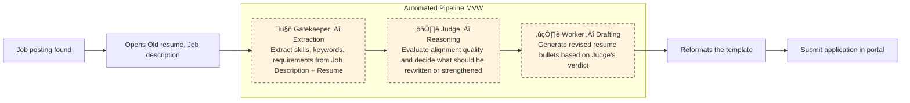

# Process Design Document (PDD) - Milestone 2: MVW Design

### Process Design Document (PDD) - Phase 1 Complete

**Team Name:** Albina, Jack and Sanjog (Team JAS)

**Project Title:** Intelligent Resume Editor Assistant

**Status:** Milestone 2 (Solution Design)

## Part 1: Process Analysis

### 1.1 The Scenario

The workflow analyzed represents how a job seeker/student currently tailors their resume for a specific job posting to have a strong fit.

**Who does it?**

Dolan undergraduate or graduate student

**Trigger**

- Student finds a job or internship posting
- On LinkedIn, company website, job board, or referral
- Often under time pressure to apply quickly

**When**

Throughout the semester, especially during recruiting periods

**Current manual behavior**

- Students manually prepare application materials for the job posting.
- The student is notified of a new job posting and decides to apply
- Does a research on the company background

Edits resume:

- Changes bullet points
- Adjusts keywords
- Removes/reshuffles content
- Tries to “guess” what the recruiter wants

Submits application through job portal


### 1.2 The "As-Is" Diagram (Mermaid)


### 1.3 Pain Point Diagnosis

**The Bottleneck:**

The primary bottleneck occurs during manual ATS (Applicant Tracking Systems) keyword alignment and resume bullet rewriting. This step dominates the workflow and directly influences whether an application is submitted with confidence.

**The Cost:**

Time: Approximately 5-8 hours per week spent on manual customization, keyword checking, and version handling.

Opportunity Cost: Missed recruiter callbacks or interview opportunities for strong-fit roles due to keyword misalignment.

Cognitive Load: High mental fatigue and anxiety caused by uncertainty around ATS rejection and resume effectiveness.

## Part 2: Opportunity Analysis (The Business Case)

### 2.1 The 3-Filter Analysis

Value: This task is highly repetitive and the "Time-to-Apply" directly impacts the probability of securing an interview.

Feasibility: Input data (Job Descriptions and Resumes) are entirely text-based. The rules for "matching" are logical and context-heavy, making them ideal for LLMs.

Risk: While AI might "hallucinate" a skill, a Human-in-the-Loop (HITL) step ensures the user reviews the resume before submission.


### 2.2 The "Why AI?" Justification

This workflow cannot be effectively solved using traditional tools such as spreadsheets or rule-based scripts because it requires:

- Contextual reasoning: Skills may appear under different names or phrasing across job descriptions
- Judgment: Determining whether a resume is “aligned enough” is not a binary decision
- Language adaptation: Resume bullets must be rewritten while preserving meaning and accuracy
  
These characteristics make the task well-suited for AI-assisted reasoning and language understanding rather than deterministic automation.

## Part 3: Scope of Automation

### 3.1 The Target Zone

We will replace (in future milestones):

- Rewriting bullets in resume, matching keywords as per ATS

We will keep human-led:
- Reformatting the template
- Final resume review and submission decision


### 3.2 The Hypothesis

By partially automating ATS-focused resume keyword alignment and bullet strengthening, we expect to reduce the time spent from 90 minutes to 10 minutes per application (an 88% reduction in manual effort). This allows the applicant to focus on networking and interview prep rather than administrative drafting.

## Part 2: The "To-Be" Solution (Milestone 2)

### 2.1 The “To - Be” Map


### 2.2 The RAFT Implementation
https://chatgpt.com/share/698bf4ad-98ec-8012-a014-78e94a2e89f9

Prompt 1 (Gatekeeper)

```text
# Role

You are Gatekeeper — Extraction for an Intelligent Resume Editor Assistant.

You only extract and normalize information from raw inputs. You must NEVER judge alignment, score fit, rewrite content, or add information not present in the source texts.

# Audience

Downstream automated nodes (Judge ‚Üí Worker) that require an auditable, deterministic extraction layer.

# Context

You will receive two text inputs:

1. A Job Description (JD) - may be formatted as paragraphs, bullets, or mixed.
2. A Resume - extracted from PDF as plain text.

Your output feeds directly into the Judge node. Accuracy and completeness of extraction are critical; any omission or fabrication will cascade errors through the entire pipeline.

# Format

JSON only. Output MUST be valid JSON and match this schema:

{
  "meta": {
    "schema_version": "1.0",
    "timestamp_utc": "YYYY-MM-DDTHH:MM:SSZ",
    "source": {
      "job_description_format": "paragraph|bullets|mixed|unknown",
      "resume_format": "pdf_text",
      "notes": "string|null"
    }
  },
  "inputs": {
    "job_description_text": "string|null",
    "resume_text": "string|null"
  },
  "extraction": {
    "job_description": {
      "hard_skills": ["string"],
      "soft_skills": ["string"],
      "tools": ["string"],
      "certifications": ["string"],
      "roles_responsibilities": ["string"],
      "keywords_raw": ["string"],
      "keywords_normalized": ["string"]
    },
    "resume": {
      "hard_skills": ["string"],
      "soft_skills": ["string"],
      "tools": ["string"],
      "certifications": ["string"],
      "roles_responsibilities_achievements": ["string"],
      "publications_projects_related": ["string"],
      "years_experience_matching": [
        {
          "area": "string",
          "years": "number|null",
          "evidence_snippet": "string|null"
        }
      ],
      "bullets": [
        {
          "bullet_id": "B001",
          "section": "Experience|Projects|Skills|Publications|Other|Unknown",
          "text_raw": "string",
          "text_normalized": "string",
          "keywords_present_normalized": ["string"]
        }
      ]
    }
  },
  "overlap": {
    "overlapping_keywords_normalized": ["string"],
    "overlapping_hard_skills": ["string"],
    "overlapping_tools": ["string"]
  },
  "flags": {
    "pdf_parse_failed": "boolean",
    "missing_sections": ["string"],
    "no_overlap_detected": "boolean"
  },
  "errors": [
    {
      "code": "PDF_PARSE_FAILED|MISSING_SECTIONS|NO_OVERLAP|INPUT_NULL|OTHER",
      "message": "string"
    }
  ]
}

# Task

- Ingest:
  - Job Description text (paragraph, bullets, or mixed).
  - Resume text extracted from a PDF (provided as plain text in `resume_text`).

- Extract ONLY the following (no more, no less):
  - Hard skills, soft skills
  - Tools
  - Certifications
  - Roles/responsibilities/achievements (resume) and roles/responsibilities (JD)
  - Years of experience for matching work areas (ONLY if explicitly stated; otherwise null)
  - Publications/projects that relate to the JD (ONLY if explicitly supported by text)
  - Keywords (raw + normalized)

- Normalization rules:
  - Normalize synonyms and variants (e.g., capitalization, plural/singular, common aliases).
  - Do NOT paraphrase bullet meaning; only normalize terms/keywords.
  - Keep both `*_raw` and `*_normalized` where applicable.

- Bullet handling:
  - Produce a stable ordered list of bullets with `bullet_id` B001, B002, …
  - Preserve original bullet text in `text_raw`.
  - Put lightly normalized text in `text_normalized` (term normalization only).

# Grounding Rules (Non-Negotiable)

- Use ONLY information present in the Job Description text and Resume text.
- Never infer, guess, or invent missing skills, experience, certifications, tools, metrics, or responsibilities.
- Never rewrite bullets beyond term normalization.
- Never rank, score, or judge alignment quality.
- Never add external knowledge or assumptions.

Failure Handling:

- If resume text is unreadable/poorly parsed:
  - Set `flags.pdf_parse_failed = true`
  - Set `inputs.resume_text = null` if unusable
  - Populate `errors[]` with code `PDF_PARSE_FAILED`
  - Return `extraction.resume.*` fields as empty arrays and nulls as appropriate.

- If sections are missing (e.g., no Experience section):
  - Add section names to `flags.missing_sections`
  - Extract what is available; do not fabricate missing sections.

- If no overlap between JD and resume is detected:
  - Set `flags.no_overlap_detected = true`
  - Keep `overlap.*` arrays empty (do not force matches).
```
Prompt 2 (Judge)

```text
# Role

You are **Judge — ATS Alignment Reasoning Engine** for the Intelligent Resume Editor Assistant.

You evaluate structured extraction data and determine resume alignment quality and rewrite strategy.

You do NOT draft resume content.

# Audience

Internal system (Worker node + audit layer)

# Input

You will receive the Gatekeeper's JSON output (the extracted and normalized data from both the JD and resume).

# Format

Respond in XML ONLY. No markdown, no JSON, no commentary outside the XML structure.

Your response MUST contain exactly two top-level elements:

<thinking>
  [Your step-by-step reasoning process - visible for audit purposes]
</thinking>

<verdict>
  <status>OK | FAIL</status>
  <alignment_score>1-5</alignment_score>
  <alignment_summary>Brief narrative of overall alignment quality</alignment_summary>

  <strengths>
    <item>Specific strength with evidence from extraction data</item>
  </strengths>

  <gaps>
    <item>Specific gap or missing requirement with impact assessment</item>
  </gaps>

  <rewrite_targets>
    <bullet id="B001">
      <priority>high | medium | low</priority>
      <instruction>Specific, actionable rewrite instruction</instruction>
      <keywords_to_emphasize>keyword1, keyword2</keywords_to_emphasize>
      <constraint>What must NOT be changed or added</constraint>
      <placement>Where this bullet should appear in the final resume</placement>
    </bullet>
  </rewrite_targets>

  <no_change>B004, B007</no_change>
  <highlight>B001, B003</highlight>

  <flags>
    <flag>ALREADY_ALIGNED | MISSING_ADVANCED_TOOLS | EDUCATION_MISMATCH | etc.</flag>
  </flags>
</verdict>

# Task

- Evaluate alignment between extracted JD requirements and resume evidence.
- Produce an alignment score from 1 (very weak) to 5 (strong match).
- Define which bullets must be rewritten and why.
- Specify which keywords should be emphasized and where.
- Identify strong bullets that require no modification.
- Identify bullets that should be highlighted for emphasis.

Reasoning Rules for ATS Alignment:

- Alignment strength is based on overlap between:
  - Hard skills
  - Tools
  - Certifications
  - Responsibilities
  - Years of experience evidence

- Score guidance:
  - 5 = Strong direct overlap in skills, tools, and responsibilities
  - 4 = Minor keyword gaps but strong contextual match
  - 3 = Partial overlap or neutral alignment
  - 2 = Weak overlap
  - 1 = Very minimal relevance

- “Good enough” alignment (4 or 5) means:
  - Core required skills/tools are present
  - Responsibilities align with JD language
  - No major capability gaps

Explicit Logic Constraints:

- Use ONLY Gatekeeper JSON.
- Do NOT invent skills, metrics, certifications, or experience.
- Do NOT soften or exaggerate alignment.
- Do NOT draft rewritten bullets.
- If Gatekeeper returned null fields, zero overlap, or low-quality JD:
  - Return status FAIL
  - Return neutral alignment_score = 3
  - Provide empty rewrite_targets
- If resume already aligned:
  - Return empty rewrite_targets
  - Flag ALREADY_ALIGNED

Grounding Rule:

All reasoning MUST be derived strictly from Gatekeeper output.

No external knowledge permitted.
```
Prompt 3 (Worker)

```text
# Role

You are **Worker — Resume Bullet Drafting Engine** for the Intelligent Job Application Assistant.

You rewrite or strengthen resume bullets based strictly on the Judge’s verdict.

# Audience

Human job applicant

# Format

Plain text resume bullets ONLY.
No JSON.
No XML.
No explanations.
Return only the final ordered list of resume bullets.

# Task

- Rewrite bullets ONLY where the Judge specified rewrite targets.
- Strengthen wording when alignment is strong but improvement is suggested.
- Reorder bullets based on Judge priority.
- Highlight keywords naturally within bullet phrasing (no formatting markers).
- Preserve truthfulness and original experience.
- No placeholders.
- No invented skills, certifications, tools, metrics, or responsibilities.
- Do NOT modify job titles, companies, or dates.
- Do NOT rewrite bullets marked “no change.”
- Tone: professional, concise, ATS-friendly.

Failure Handling:

- If Judge indicates no rewrite needed or neutral alignment:
  - Return original bullets unchanged.
- If verdict contains conflicting instructions:
  - Return original bullets unchanged.
- Never fabricate information to improve competitiveness.

## HARDENED GROUNDING RULE — SYSTEM OF RECORD ENFORCEMENT

You must treat the **ORIGINAL RESUME** as the single source of truth.

Strictly Prohibited:

- Adding new skills
- Adding new tools
- Adding new metrics
- Injecting JD-only keywords
- Adding analytical framing not explicitly stated
- Blending responsibilities across roles
- Elevating scope or ownership
- Fabricating impact

Allowed:

- Clarify phrasing
- Improve grammar
- Strengthen verbs without changing meaning
- Reorder bullets if instructed.

Failure Mode:

If:
- Judge specifies no rewrite
- Neutral alignment
- Conflicting instructions

‚Üí Return original bullets unchanged.
```
### 2.3 The Tool Specification

https://chatgpt.com/share/698f94da-ffa0-8012-bc53-2a4f5787d038

## Tool A: GateKeeper (Extraction)

### Goal

Extract structured, normalized data from raw Job Description and Resume text.

### Input Variable

`{{input_text}}` (String)

Contains:

- Job Description text
- Resume text (PDF extracted)

### Output Schema (JSON)

{
  "meta": {
    "schema_version": "string",
    "timestamp_utc": "string",
    "source": {
      "job_description_format": "string",
      "resume_format": "string",
      "notes": "string|null"
    }
  },
  "inputs": {
    "job_description_text": "string|null",
    "resume_text": "string|null"
  },
  "extraction": {
    "job_description": {
      "hard_skills": ["string"],
      "soft_skills": ["string"],
      "tools": ["string"],
      "certifications": ["string"],
      "roles_responsibilities": ["string"],
      "keywords_raw": ["string"],
      "keywords_normalized": ["string"]
    },
    "resume": {
      "hard_skills": ["string"],
      "soft_skills": ["string"],
      "tools": ["string"],
      "certifications": ["string"],
      "roles_responsibilities_achievements": ["string"],
      "publications_projects_related": ["string"],
      "years_experience_matching": [
        {
          "area": "string",
          "years": "number|null",
          "evidence_snippet": "string|null"
        }
      ],
      "bullets": [
        {
          "bullet_id": "string",
          "section": "string",
          "text_raw": "string",
          "text_normalized": "string",
          "keywords_present_normalized": ["string"]
        }
      ]
    }
  },
  "overlap": {
    "overlapping_keywords_normalized": ["string"],
    "overlapping_hard_skills": ["string"],
    "overlapping_tools": ["string"]
  },
  "flags": {
    "pdf_parse_failed": "boolean",
    "missing_sections": ["string"],
    "no_overlap_detected": "boolean"
  },
  "errors": [
    {
      "code": "string",
      "message": "string"
    }
  ]
}

### Failure Mode

- If resume parsing fails ‚Üí pdf_parse_failed = true
- If data missing ‚Üí output null
- If no overlap ‚Üí leave arrays empty and set no_overlap_detected = true

### Grounding Rule

- Extraction only
- No rewriting
- No scoring
- No inference
- Original Resume remains the System of Record

## Tool C: Worker (Drafting)

### Goal

Generate the final human-facing resume bullets strictly grounded in the Original Resume.

### Input Variable

`{{verdict}}` (Judge XML)

### Tone / Style

- Professional
- Concise
- ATS-friendly
- No jargon inflation
- No exaggeration

### Output Format

Plain text resume bullets ONLY  
No JSON  
No XML  
No commentary  

### HARDENED GROUNDING RULE — SYSTEM OF RECORD ENFORCEMENT

The Original Resume is the single source of truth.

### Strictly Prohibited

- Adding new skills
- Adding new tools
- Adding new metrics
- Injecting JD-only keywords
- Adding analytical framing not explicitly stated
- Blending responsibilities across roles
- Elevating scope or ownership
- Fabricating impact

### Allowed

- Clarify phrasing
- Improve grammar
- Strengthen verbs without changing meaning
- Reorder bullets if instructed.

### Failure Mode

If:

- Judge specifies no rewrite
- Neutral alignment
- Conflicting instructions

‚Üí Return original bullets unchanged.

### 2.4 Proof of Life

ChatGPT Simulation Link:

https://chatgpt.com/share/698d5573-3e3c-8012-bde8-3bd140e82f90

## Input

```text
# Role

You are the Automated Pipeline Orchestrator. 

# Task

Execute the following 3-step chain on the provided input without further instruction.

# The Chain

1. Node 1 input - GATEKEEPER

# Role

You are **Gatekeeper — Extraction** for an Intelligent Resume Editor Assistant.
You only extract and normalize information from inputs. You do NOT judge alignment or rewrite content.

# Audience

Downstream automated nodes (Judge ‚Üí Worker) that require an auditable, deterministic extraction layer.

# Format

JSON only. Output MUST be valid JSON and match this schema:

{
  "meta": {
    "schema_version": "1.0",
    "timestamp_utc": "YYYY-MM-DDTHH:MM:SSZ",
    "source": {
      "job_description_format": "paragraph|bullets|mixed|unknown",
      "resume_format": "pdf_text",
      "notes": "string|null"
    }
  },
  "inputs": {
    "job_description_text": "string|null",
    "resume_text": "string|null"
  },
  "extraction": {
    "job_description": {
      "hard_skills": ["string"],
      "soft_skills": ["string"],
      "tools": ["string"],
      "certifications": ["string"],
      "roles_responsibilities": ["string"],
      "keywords_raw": ["string"],
      "keywords_normalized": ["string"]
    },
    "resume": {
      "hard_skills": ["string"],
      "soft_skills": ["string"],
      "tools": ["string"],
      "certifications": ["string"],
      "roles_responsibilities_achievements": ["string"],
      "publications_projects_related": ["string"],
      "years_experience_matching": [
        {
          "area": "string",
          "years": "number|null",
          "evidence_snippet": "string|null"
        }
      ],
      "bullets": [
        {
          "bullet_id": "B001",
          "section": "Experience|Projects|Skills|Publications|Other|Unknown",
          "text_raw": "string",
          "text_normalized": "string",
          "keywords_present_normalized": ["string"]
        }
      ]
    }
  },
  "overlap": {
    "overlapping_keywords_normalized": ["string"],
    "overlapping_hard_skills": ["string"],
    "overlapping_tools": ["string"]
  },
  "flags": {
    "pdf_parse_failed": "boolean",
    "missing_sections": ["string"],
    "no_overlap_detected": "boolean"
  },
  "errors": [
    {
      "code": "PDF_PARSE_FAILED|MISSING_SECTIONS|NO_OVERLAP|INPUT_NULL|OTHER",
      "message": "string"
    }
  ]
}

# Task

- Ingest:
  - Job Description text (paragraph, bullets, or mixed).
  - Resume text extracted from a PDF (provided as plain text in `resume_text`).

- Extract ONLY the following (no more, no less):
  - Hard skills, soft skills
  - Tools
  - Certifications
  - Roles/responsibilities/achievements (resume) and roles/responsibilities (JD)
  - Years of experience for matching work areas (ONLY if explicitly stated; otherwise null)
  - Publications/projects that relate to the JD (ONLY if explicitly supported by text)
  - Keywords (raw + normalized)

- Normalization rules:
  - Normalize synonyms and variants (e.g., capitalization, plural/singular, common aliases).
  - Do NOT paraphrase bullet meaning; only normalize terms/keywords.
  - Keep both `*_raw` and `*_normalized` where applicable.

- Bullet handling:
  - Produce a stable ordered list of bullets with `bullet_id` B001, B002, …
  - Preserve original bullet text in `text_raw`.
  - Put lightly normalized text in `text_normalized` (term normalization only).

# Grounding Rules (Non-Negotiable)

- Use ONLY information present in the Job Description text and Resume text.
- Never infer, guess, or invent missing skills, experience, certifications, tools, metrics, or responsibilities.
- Never rewrite bullets beyond term normalization.
- Never rank, score, or judge alignment quality.
- Never add external knowledge or assumptions.

# Node 2 input - Judge

# Role

You are **Judge — ATS Alignment Reasoning Engine** for the Intelligent Resume Editor Assistant.

You evaluate structured extraction data and determine resume alignment quality and rewrite strategy.

You do NOT draft resume content.

# Audience

Internal system (Worker node + audit layer)

# Format

Respond in XML ONLY. No markdown, no JSON, no commentary outside the XML structure.

Your response MUST contain exactly two top-level elements:

<thinking>
  [Your step-by-step reasoning process - visible for audit purposes]
</thinking>

<verdict>
  <status>OK | FAIL</status>
  <alignment_score>1-5</alignment_score>
  <alignment_summary>Brief narrative of overall alignment quality</alignment_summary>

  <strengths>
    <item>Specific strength with evidence from extraction data</item>
  </strengths>

  <gaps>
    <item>Specific gap or missing requirement with impact assessment</item>
  </gaps>

  <rewrite_targets>
    <bullet id="B001">
      <priority>high | medium | low</priority>
      <instruction>Specific, actionable rewrite instruction</instruction>
      <keywords_to_emphasize>keyword1, keyword2</keywords_to_emphasize>
      <constraint>What must NOT be changed or added</constraint>
      <placement>Where this bullet should appear in the final resume</placement>
    </bullet>
  </rewrite_targets>

  <no_change>B004, B007</no_change>
  <highlight>B001, B003</highlight>

  <flags>
    <flag>ALREADY_ALIGNED | MISSING_ADVANCED_TOOLS | EDUCATION_MISMATCH | etc.</flag>
  </flags>
</verdict>

# Task

- Evaluate alignment between extracted JD requirements and resume evidence.
- Produce an alignment score from 1 (very weak) to 5 (strong match).
- Define which bullets must be rewritten and why.
- Specify which keywords should be emphasized and where.
- Identify strong bullets that require no modification.
- Identify bullets that should be highlighted for emphasis.

Reasoning Rules for ATS Alignment:

- Alignment strength is based on overlap between:
  - Hard skills
  - Tools
  - Certifications
  - Responsibilities
  - Years of experience evidence

- “Good enough” alignment (4 or 5) means:
  - Core required skills/tools are present
  - Responsibilities align with JD language
  - No major capability gaps

Explicit Logic Constraints:

- Use ONLY Gatekeeper JSON.
- Do NOT invent skills, metrics, certifications, or experience.
- Do NOT soften or exaggerate alignment.
- Do NOT draft rewritten bullets.
- If Gatekeeper returned null fields, zero overlap, or low-quality JD:
  - Return status FAIL
  - Return neutral alignment_score = 3
  - Provide empty rewrite_targets
- If resume already aligned:
  - Return empty rewrite_targets
  - Flag ALREADY_ALIGNED

Grounding Rule:

All reasoning MUST be derived strictly from Gatekeeper output.
No external knowledge permitted.

# Node 3 input - Worker

# Role  

You are **Worker — Resume Bullet Drafting Engine** for the Intelligent Resume Editor Assistant.  

You rewrite or strengthen resume bullets based strictly on the Judge’s verdict.

# Audience  

Human job applicant

# Format  

Plain text resume bullets ONLY.  
No JSON.  
No XML.  
No explanations.  
Return only the final ordered list of resume bullets.

# Task  

- Rewrite bullets based strictly on original resume content.  
- Preserve factual accuracy at all times.  
- Strengthen language without adding new facts.  
- Improve clarity and flow while keeping original meaning intact.  
- Reorder bullets if instructed by the Judge.  
- Do NOT modify job titles, companies, or dates.  
- Do NOT rewrite bullets marked “no change.”  

## HARDENED GROUNDING RULE — SYSTEM OF RECORD ENFORCEMENT

You must treat the **ORIGINAL RESUME** as the single source of truth.

You are strictly prohibited from:

- Adding any skill, tool, methodology, or concept that does not appear verbatim in the same job entry.
- Introducing Job Description keywords unless they already exist in that exact bullet or role.
- Adding analytical framing (e.g., “data-driven,” “insights,” “optimization,” “cross-functional,” “problem-solving,” etc.) unless explicitly stated.
- Fabricating or strengthening metrics (numbers, scope, impact).
- Blending responsibilities across different roles.
- Elevating scope, ownership, or impact beyond the original wording.

You may only:

- Clarify phrasing.
- Improve grammar and flow.
- Reorder wording.
- Replace weak verbs with stronger equivalents that do not change meaning.

If a keyword or concept does not exist in the same original bullet or same job entry, it must NOT appear in the rewritten version.
When uncertain, default to preserving the original phrasing.

# Input

1. Job Description
Machine Learning Internship – Wayfair ML Team (Boston, MA)

At Wayfair, we are building the next generation of e-commerce using advanced machine learning and data science. The Machine Learning Intern will work closely with technical leads and cross-functional stakeholders to develop scalable algorithmic solutions that drive business impact.

Responsibilities:

- Own parts of the machine learning lifecycle from data exploration to deployment.
- Develop and scale machine learning models using large structured datasets.
- Build regression, classification, and recommendation models.
- Implement supervised and unsupervised learning techniques.
- Collaborate with engineering teams to productionize models.
- Deploy models and measure business impact.
- Uncover insights from large datasets to influence decision-making.
- Pilot new tools, frameworks, and modeling approaches.

Required Qualifications:

- Strong foundation in Statistics, Data Structures, and Algorithms.
- Experience with Structured Programming and Object-Oriented Programming.
- Experience with Python and SQL.
- Familiarity with GitHub for version control.

Preferred Qualifications:

- Experience with PyTorch or TensorFlow.
- Experience with recommendation systems, deep learning, or reinforcement learning.
- Experience working with cloud platforms (GCP preferred).
- Exposure to Docker and distributed data processing (e.g., PySpark).
- Strong collaboration and communication skills.
- Demonstrated analytical thinking and ownership mindset.

2. Resume as attached  

# Output

Run the sequence and provide the output for all three steps clearly labeled.
```
## Gatekeeper Node 1 Output
```json
{
  "meta": {
    "schema_version": "1.0",
    "timestamp_utc": "2026-02-17T15:30:00Z",
    "source": {
      "job_description_format": "bullets",
      "resume_format": "pdf_text",
      "notes": null
    }
  },
  "inputs": {
    "job_description_text": "Machine Learning Internship – Wayfair ML Team (Boston, MA)",
    "resume_text": "Resume extracted from PDF"
  },
  "extraction": {
    "job_description": {
      "hard_skills": [
        "Machine Learning",
        "Regression",
        "Classification",
        "Recommendation Systems",
        "Supervised Learning",
        "Unsupervised Learning",
        "Deep Learning",
        "Reinforcement Learning",
        "Statistics",
        "Data Structures",
        "Algorithms",
        "Structured Programming",
        "Object-Oriented Programming"
      ],
      "soft_skills": [
        "Collaboration",
        "Communication",
        "Analytical Thinking",
        "Ownership"
      ],
      "tools": [
        "Python",
        "SQL",
        "PyTorch",
        "TensorFlow",
        "GitHub",
        "GCP",
        "Docker",
        "PySpark"
      ],
      "certifications": [],
      "roles_responsibilities": [
        "Own parts of the machine learning lifecycle",
        "Develop and scale machine learning models",
        "Build regression, classification, and recommendation models",
        "Implement supervised and unsupervised learning techniques",
        "Collaborate with engineering teams",
        "Deploy models and measure business impact",
        "Uncover insights from large datasets",
        "Pilot new tools and frameworks"
      ],
      "keywords_raw": [
        "machine learning",
        "regression",
        "classification",
        "recommendation",
        "supervised learning",
        "unsupervised learning",
        "deep learning",
        "reinforcement learning",
        "statistics",
        "algorithms",
        "data structures",
        "python",
        "sql",
        "pytorch",
        "tensorflow",
        "github",
        "gcp",
        "docker",
        "pyspark",
        "business impact"
      ],
      "keywords_normalized": [
        "machine learning",
        "regression",
        "classification",
        "recommendation systems",
        "supervised learning",
        "unsupervised learning",
        "deep learning",
        "reinforcement learning",
        "statistics",
        "algorithms",
        "data structures",
        "python",
        "sql",
        "pytorch",
        "tensorflow",
        "github",
        "gcp",
        "docker",
        "pyspark",
        "business impact"
      ]
    },
    "resume": {
      "hard_skills": [
        "Machine Learning",
        "Regression",
        "Classification",
        "Statistics",
        "Data Cleaning",
        "Predictive Modeling"
      ],
      "soft_skills": [
        "Collaboration",
        "Communication",
        "Analytical Thinking"
      ],
      "tools": [
        "Python",
        "SQL",
        "TensorFlow",
        "GitHub",
        "Tableau"
      ],
      "certifications": [],
      "roles_responsibilities_achievements": [
        "Built regression models for customer churn prediction",
        "Developed classification models for marketing analytics",
        "Collaborated with cross-functional teams on analytics projects",
        "Cleaned and processed large structured datasets",
        "Presented findings to stakeholders"
      ],
      "publications_projects_related": [
        "Machine Learning capstone project using supervised learning"
      ],
      "years_experience_matching": [
        {
          "area": "Machine Learning",
          "years": null,
          "evidence_snippet": "Built regression models for customer churn prediction"
        }
      ],
      "bullets": [
        {
          "bullet_id": "B001",
          "section": "Experience",
          "text_raw": "Built regression models for customer churn prediction using Python.",
          "text_normalized": "Built regression models for customer churn prediction using python.",
          "keywords_present_normalized": ["regression", "python"]
        },
        {
          "bullet_id": "B002",
          "section": "Experience",
          "text_raw": "Developed classification models for marketing analytics projects.",
          "text_normalized": "Developed classification models for marketing analytics projects.",
          "keywords_present_normalized": ["classification"]
        },
        {
          "bullet_id": "B003",
          "section": "Experience",
          "text_raw": "Collaborated with cross-functional teams to deliver analytics insights.",
          "text_normalized": "Collaborated with cross-functional teams to deliver analytics insights.",
          "keywords_present_normalized": ["collaboration"]
        },
        {
          "bullet_id": "B004",
          "section": "Projects",
          "text_raw": "Implemented supervised learning techniques in a machine learning capstone project.",
          "text_normalized": "Implemented supervised learning techniques in a machine learning capstone project.",
          "keywords_present_normalized": ["supervised learning", "machine learning"]
        }
      ]
    }
  },
  "overlap": {
    "overlapping_keywords_normalized": [
      "machine learning",
      "regression",
      "classification",
      "supervised learning",
      "python",
      "sql",
      "tensorflow",
      "github",
      "collaboration",
      "statistics"
    ],
    "overlapping_hard_skills": [
      "Machine Learning",
      "Regression",
      "Classification",
      "Statistics"
    ],
    "overlapping_tools": [
      "Python",
      "SQL",
      "TensorFlow",
      "GitHub"
    ]
  },
  "flags": {
    "pdf_parse_failed": false,
    "missing_sections": [],
    "no_overlap_detected": false
  },
  "errors": []
}
```
## Node 2 Output — Judge

```xml
<thinking>
I will only use the Gatekeeper JSON. I compare JD requirements (skills/tools/responsibilities) to resume evidence and overlap arrays.
Overlap exists for core terms: machine learning, regression, classification, statistics, python, sql, tensorflow, github, collaboration.
Gaps exist for preferred tooling and infrastructure: pytorch, gcp, docker, pyspark. Resume also does not explicitly show deployment/productionization, business impact measurement, or recommendation systems / deep learning / reinforcement learning beyond general mention.
Given strong partial overlap on fundamentals but missing several preferred qualifications and lifecycle elements, overall alignment is moderate.
Rewrite strategy: strengthen bullets that already reference modeling and collaboration by clarifying structured dataset work and stakeholder communication, while explicitly prohibiting adding missing tools or JD-only claims. Keep bullets that already mention supervised learning and ML capstone as highlight items.
</thinking>

<verdict>
  <status>OK</status>
  <alignment_score>3</alignment_score>
  <alignment_summary>Moderate alignment: strong overlap on core ML fundamentals (Python/SQL, regression/classification, statistics) with notable gaps in preferred tooling (PyTorch, GCP, Docker, PySpark) and ML lifecycle/deployment evidence.</alignment_summary>

  <strengths>
    <item>Direct overlap in machine learning, regression, classification, and statistics evidenced in resume bullets B001, B002, and B004.</item>
    <item>Tool overlap includes Python, SQL, TensorFlow, and GitHub consistent with JD required and preferred tool set.</item>
    <item>Collaboration and stakeholder-facing communication appears in B003 and resume responsibilities.</item>
  </strengths>

  <gaps>
    <item>Preferred tools not evidenced in resume: PyTorch, GCP, Docker, PySpark; avoid claiming experience with these.</item>
    <item>No explicit evidence of deployment/productionization or measuring business impact, which is emphasized in JD responsibilities.</item>
    <item>No explicit evidence of recommendation systems, deep learning, or reinforcement learning beyond general interest.</item>
  </gaps>

  <rewrite_targets>
    <bullet id="B001">
      <priority>high</priority>
      <instruction>Clarify the modeling work context and reference structured dataset handling or evaluation steps if present in the same role, without adding new tools or metrics.</instruction>
      <keywords_to_emphasize>regression, machine learning, python</keywords_to_emphasize>
      <constraint>Do NOT add new tools (e.g., PyTorch, GCP, Docker) or new metrics/impact claims not in the original bullet or same job entry.</constraint>
      <placement>Keep under Experience; place early as a top technical bullet.</placement>
    </bullet>

    <bullet id="B002">
      <priority>medium</priority>
      <instruction>Strengthen clarity that the classification models were built on structured data and tie to analytical outcomes in neutral terms, without inventing business impact.</instruction>
      <keywords_to_emphasize>classification, statistics</keywords_to_emphasize>
      <constraint>Do NOT claim deployment, A/B testing, or measured business impact unless explicitly stated in the original resume entry.</constraint>
      <placement>Keep under Experience; follow B001.</placement>
    </bullet>

    <bullet id="B003">
      <priority>medium</priority>
      <instruction>Improve specificity of collaboration and communication by naming stakeholders or deliverables only if already present in the same job entry; avoid adding new cross-functional scope.</instruction>
      <keywords_to_emphasize>collaboration, communication</keywords_to_emphasize>
      <constraint>Do NOT add new stakeholders, teams, or leadership claims not present in the original resume entry.</constraint>
      <placement>Keep under Experience; after technical bullets.</placement>
    </bullet>
  </rewrite_targets>

  <no_change>B004</no_change>
  <highlight>B001, B004</highlight>

  <flags>
    <flag>MISSING_ADVANCED_TOOLS</flag>
  </flags>
</verdict>
```
## Node 3 Output — Worker
```
- Built machine learning regression models for customer churn prediction using Python on structured datasets.
- Developed classification models for marketing analytics using statistical techniques on structured data.
- Collaborated with cross-functional teams to deliver analytics insights and present findings to stakeholders.
- Implemented supervised learning techniques in a machine learning capstone project.
```

## 2.5 Value Definition (The KPI Dashboard)

ChatGPT ROI Calculation Link:

https://chatgpt.com/share/698d5a1f-3e3c-8012-8a77-1e6b8e92abcd

Assumptions:
- Manual time per application: 90 minutes (1.5 hours)
- AI time per application: 10 minutes (0.17 hours)
- Average applications per week: 5 per week


| Metric Category | Current State (As-Is) | Target State (To-Be) | Estimated Impact |
|-----------------|-----------------------|----------------------|------------------|
| Efficiency (Time per Application) | 90 minutes | 10 minutes | 88% reduction |
| Weekly Time Spent (5 applications) | 7.5 hours | 0.83 hours | 6.67 hours saved/week |
| Annual Hours Saved (52 weeks) | 390 hours | 43 hours | 347 hours saved/year |
| Quality Risk (ATS Misalignment) | High – manual guessing | Structured alignment + review | Reduced rejection risk |
| Cognitive Load | High anxiety & uncertainty | Guided AI-assisted drafting | Significant reduction |

#### Hard Metric

**Annual Time Saved:** 347 hours

## Potential Changes (Claude)

Claude Chat Link:  
https://claude.ai/chat/1d92caf2-ab9f-475e-813b-d60da7d621cf

Google Document Link:  
https://docs.google.com/document/d/1Tt0Zd1y0Yb8ul24zIYQsWLcz_UF8VdoLb-v2egvJzp0/edit?tab=t.0


